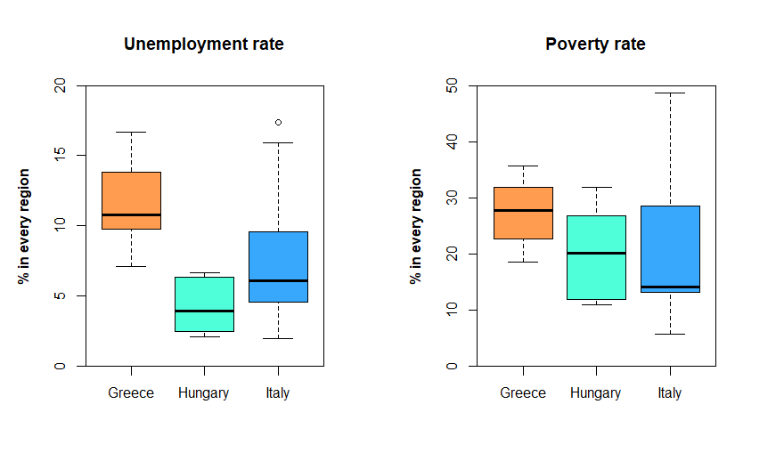
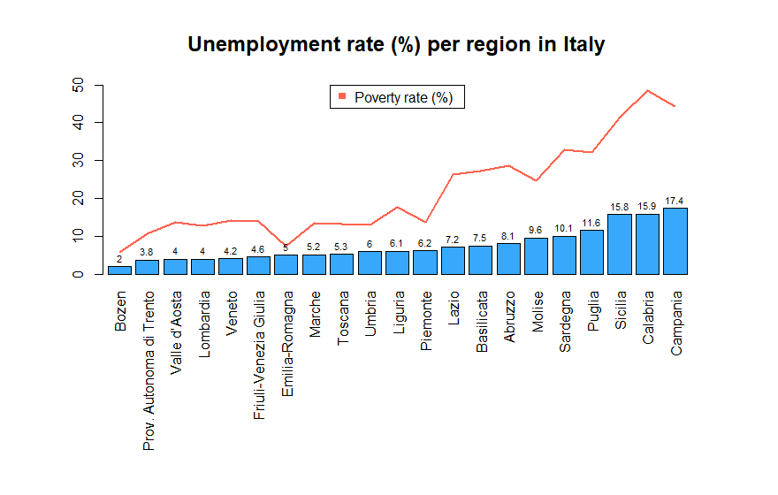
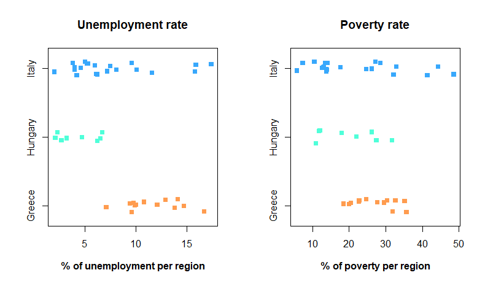

# Political and Peace Data Analysis

This repository contains two R scripts analyzing political and peace-related metrics across various countries and regions.

## Script 1: Political Polarization and Ideology Analysis

This script explores relationships between poverty, unemployment rate, and political polarization measured by the Dalton Polarization Index. The countries analyzed are Greece, Italy and Hungary, also analyzing per by regions within each of them according to the NUTS 2 classification.
- **UnemploymentRate**: total unemployment rate 2023. Source: [Eurostat](https://ec.europa.eu/eurostat/databrowser/view/LFST_R_LFU3RT/default/table?lang=en)  
- **Poverty**:percentage of persons at risk of poverty or social exclusion 2023. Source: [Eurostat](https://ec.europa.eu/eurostat/databrowser/view/LFST_R_LFU3RT/default/table?lang=en)
- **DaltonPolarization**: Index measuring how spread political parties are on the left-right spectrum (0 = all parties at the same point, 10 = parties at ideological extremes).  Source: [European Political Barometer](https://eupoliticalbarometer.uc3m.es/)
- **CountryIdeology**: Metric of a country's typical ideology on a 0 (far left) to 10 (far right) scale.  
Data is analyzed for Greece, Hungary, and Italy, also separated by regions within each country.  
Source: [European Political Barometer](https://eupoliticalbarometer.uc3m.es/)

### Visualizations from Script 1

  
Boxplot showing the distribution of unemployment and poverty rates.

  
Regional unemployment rates across Italy.

  
Stripbar chart illustrating key comparisons among variables.
## Script 2: Global Peace Index Prediction

This script develops a predictive model for the Global Peace Index (GPI) using data from 2023 across multiple countries. The goal is to identify key factors influencing peace levels globally. 
The variables analyzed are:
- **MilitaryExpenditure**: military expenditure as a % of GDP (World bank)
- **Inflation**: inflation rate in % (World bank)
- **GPI**: global peace index (Institute for Economics & Peace). It measures the level of Negative Peace in a country. This data can be used to quantify global peacefulness and help to understand the factors that create peace in a society. The scores are calculated on a scale of 1-5 with 5 representing
 a high degree of violence in a country.
- **OECD**: 1 if the country belongs to OECD and 0 otherwise.
- **GDPpc**: GDP per capita in US dollars.

---

Both analyses were done as academic projects for the Master in Geopolitics and Strategic Studies at University Carlos III of Madrid. The research tries to uncover meaningful patterns in political and social datasets.
